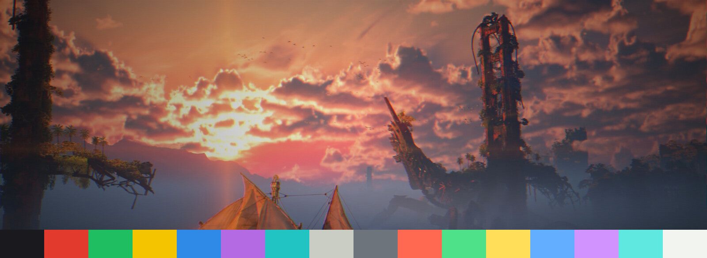

<div align="center">

# 🎮 PlayStation 1 — an Omarchy theme

**Boot-screen blue, the four face-button colors, and a real CRT.**
A retro [Omarchy](https://omarchy.org/) theme channeling the original Sony PlayStation — deep-blue palette, swirling red/green/blue/yellow accents, and a **CRT screen shader** (scanlines, aperture grille, barrel curvature, chromatic aberration) that turns on with the theme.



<sub>Signature wallpaper + the theme's 16-color palette. Desktop screenshots welcome — see [docs/screenshots](docs/screenshots/).</sub>

</div>

---

## ✨ Features

- **PS1 boot-era palette** — deep blue on near-black, driven from a single `colors.toml`.
- **Swirling face-button border** — the active window border cycles ▲ ● ✕ ■ red/green/blue/yellow.
- **Built-in CRT shader** — scanlines, RGB aperture grille, barrel curvature with a black bezel, chromatic aberration, phosphor bloom and vignette. Tuned to read on HiDPI panels. **Auto-applies with the theme; clears when you switch away.**
- **Native install** — the theme *and* the CRT install with Omarchy's one-line theme manager (the shader ships inside the theme).
- **Optional `SUPER+F10` degauss toggle** and an optional themed lock screen.
- **Optional Quickshell desktop suite** — a themed audio visualizer (a *flowing current of the ✕ △ □ ○ glyphs*), app launcher, power menu, and workspace overview. Opt-in and fully reversible.
- Every shader effect is a labeled constant — tune it in seconds.

## 🎨 Palette

| Role | Color | |
|------|-------|--|
| Background | `#0A0A0C` | near-black |
| Accent | `#2E8AE6` | PS blue |
| Red | `#E23B2E` | ● circle |
| Green | `#1FBF61` | ▲ triangle |
| Yellow | `#F5C400` | ■ square / cursor |
| Blue | `#2E8AE6` | ✕ cross |

See `colors.toml` for the full 16-color set.

---

## 🚀 Install

### Option A — Omarchy native (recommended, one line — includes the CRT)

```bash
omarchy theme install https://github.com/Mhsbrian/omarchy-playstation-1-theme.git
```

Installs the theme **with the CRT shader** and applies it. The shader lives
inside the theme and turns on automatically.

### Option B — Script (adds the F10 toggle, lock screen, and/or Quickshell suite)

```bash
git clone https://github.com/Mhsbrian/omarchy-playstation-1-theme.git
cd omarchy-playstation-1-theme

./install.sh                     # theme + CRT
./install.sh --with-crt-toggle   # + SUPER+F10 degauss toggle
./install.sh --with-shell        # + visualizer, launcher, power menu, overview
./install.sh --all               # everything (toggle + lock screen + Quickshell suite)
```

Pick individual extras with `--with-visualizer`, `--with-launcher`, `--with-power`,
`--with-overview`, or `--with-lockscreen`. Run `./install.sh --help` for the full list.

Then apply:

```bash
omarchy theme set "Playstation 1"
```

Preview any run with `--dry-run`. Details in [docs/INSTALLATION.md](docs/INSTALLATION.md).

## 🗑️ Uninstall

```bash
./uninstall.sh                       # remove theme, CRT, toggle
./uninstall.sh --with-lockscreen     # also restore the default hyprlock flow
./uninstall.sh --with-shell          # also remove the Quickshell suite
```

---

## 📺 The CRT shader

The signature feature. It auto-applies via the theme's `hyprland.conf`
(`decoration:screen_shader`) and reads through `~/.config/omarchy/current/theme/`,
so it's active only while PlayStation 1 is your theme.

- **Toggle live:** `SUPER+F10` (with `--with-crt-toggle`), or
  `hyprctl keyword decoration:screen_shader ""` to clear it by hand.
- **Tune it:** every effect is a labeled constant at the top of
  `shaders/crt-ps1.glsl` — `SCANLINE_STRENGTH`, `CURVE`, `ABERRATION`, … 

Full breakdown, tuning presets (subtle → arcade), and HiDPI notes in
**[docs/CRT-SHADER.md](docs/CRT-SHADER.md)**.

> Requires a Hyprland build supporting `decoration:screen_shader` (GLES 3.0).

---

## 📦 What's in the box

```
colors.toml, hyprland.conf, hyprlock.conf, mako.ini, walker.css, btop.theme,
neovim.lua, icons.theme, backgrounds/, shaders/crt-ps1.glsl   ← theme (repo root)
extras/bin/crt-toggle              ← optional SUPER+F10 toggle
extras/lockscreen/                 ← optional themed Quickshell lock
extras/quickshell/                 ← optional suite: visualizer, launcher,
                                      power, overview, shared theme-fx/
install.sh · uninstall.sh · lib/   ← installer
docs/                              ← guides, CRT deep-dive, screenshots
```

## 🔒 Optional lock screen

`--with-lockscreen` installs a themed Quickshell lock (a PS1 memory-card look)
that replaces `hyprlock`. It's **invasive** (edits `hypridle.conf`, rebinds
`SUPER+CTRL+L`) but fully reversible, keeps `hyprlock` as a fallback, and backs
up your config first. Test it once at your keyboard before relying on the idle
lock. See [docs/INSTALLATION.md](docs/INSTALLATION.md#optional-lock-screen).

## 🖥️ Optional Quickshell desktop suite

`--with-shell` installs four themed, standalone Quickshell components. Each reads
the active theme's `colors.toml` and adapts, adds a keybind + an autostart entry
(marker-managed, fully reversible), and starts immediately:

| Component | Keybind | What it is |
|-----------|---------|------------|
| **Audio visualizer** | `SUPER+M` | A bottom-edge `cava` spectrum. On PlayStation it's a *flowing current of the ✕ △ □ ○ glyphs* in the four face-button colors, drifting and riding the audio like symbols on water. Needs [`cava`](https://github.com/karlstav/cava). |
| **App launcher** | `SUPER+Space` (also `SUPER+D`) | Fuzzy application search with icons. Overrides Omarchy's `walker` launcher. Needs `python3`. |
| **Power menu** | `SUPER+Escape` | Lock / suspend / log out / restart / shut down. Overrides Omarchy's system menu. |
| **Workspace overview** | `SUPER+E` | A live mini-map of every workspace and its windows. |

Install them together with `--with-shell`, or cherry-pick individual flags. The
four share a small `theme-fx/` shader directory (installed once, pruned on
uninstall once nothing else needs it). Remove with `./uninstall.sh --with-shell`.

## 📋 Requirements

Omarchy (Hyprland with `decoration:screen_shader`, GLES 3.0). Optional scripts
need `~/.local/bin` on your `$PATH`; the lock screen and Quickshell suite need
`quickshell`, the **visualizer** additionally needs `cava`, and the **launcher**
needs `python3`. You don't have to hunt these down — `install.sh` checks the
packages the extras you picked require, lists anything missing, and (with your
confirmation) installs them via `sudo pacman`. Skip that step with `--skip-deps`,
or auto-confirm with `--yes`.

## 📜 License

[MIT](LICENSE). Inspired by the Sony PlayStation boot aesthetic; no Sony assets
are redistributed. "PlayStation" is a trademark of Sony Interactive
Entertainment — this is an unofficial, fan-made color theme.
